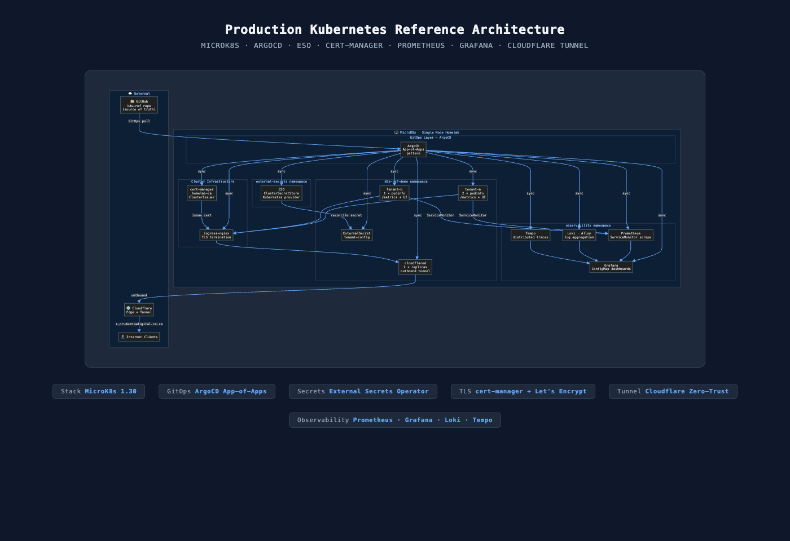

# Architecture

## System Overview



The full-stack GitOps pipeline: GitHub → ArgoCD App-of-Apps → namespaced workloads, with External Secrets Operator, cert-manager, Prometheus/Grafana/Loki/Tempo observability, and zero-trust public exposure via Cloudflare Tunnel.

Source: [`assets/architecture.mmd`](assets/architecture.mmd) (Mermaid — re-render via `assets/render-diagram.html`)

---

## Control Plane

| Component | Role | How managed |
|---|---|---|
| MicroK8s 1.30 | Cluster runtime | snap addon ecosystem |
| ArgoCD | GitOps controller (App-of-Apps) | Helm chart, ArgoCD self-manages |
| ingress-nginx | TLS termination + routing | ArgoCD ApplicationSet |
| cert-manager | Automated cert issuance (homelab-ca) | ArgoCD ApplicationSet |
| External Secrets Operator | Secret reconciliation (K8s provider) | ArgoCD ApplicationSet |

## GitOps Flow

```
git push → GitHub webhook → ArgoCD poll (3 min) → diff computed →
  sync wave 0: namespaces + RBAC
  sync wave 1: infrastructure (cert-manager, ESO, ingress)
  sync wave 2: workloads (k8s-ref-demo tenants)
  sync wave 3: observability (Prometheus, Grafana, Loki, Tempo)
```

## Networking

- **Ingress class:** `public` (ingress-nginx)
- **TLS:** cert-manager + `homelab-ca` ClusterIssuer — cert per Ingress on annotation
- **External access:** cloudflared (2 replicas) → Cloudflare Edge → `*.prudentiadigital.co.za`
- **Internal policy:** NetworkPolicy default-deny per namespace (planned M3)

## Secrets Flow

```
ClusterSecretStore (K8s provider)
  └── ExternalSecret (tenant-config, refresh 1h)
        └── Kubernetes Secret → mounted as env in podinfo Deployment
```

Swap provider to Vault or AWS Secrets Manager with no ExternalSecret changes needed.

## Observability Flow

```
podinfo /metrics → ServiceMonitor → Prometheus scrape (all-namespace selector)
podinfo logs → Alloy DaemonSet → Loki
Grafana sidecar watches ConfigMap label grafana_dashboard="1" → auto-loads dashboard
```

Golden signals (latency, traffic, errors, saturation) visible in Grafana without manual provisioning.

## Backup / DR

- etcd snapshots: MicroK8s built-in (planned cron — M3)
- PV backup: Velero (planned M4)
- Restore drill: documented in `docs/runbooks/`

## Relevant ADRs

| ADR | Decision | Status |
|---|---|---|
| [0001](../decisions/0001-record-architecture-decisions.md) | Use ADRs for all non-trivial decisions | Accepted |
| [0002](../decisions/0002-homelab-distribution-microk8s-vs-k3s-vs-kind.md) | MicroK8s vs k3s vs kind | Accepted (M1 W1) |
| [0003](../decisions/0003-secret-management-eso-vs-sealed-secrets.md) | ESO + K8s SecretStore (demo); Vault prod-swap M2 | Accepted (M1 W2) |

## Diagrams

| File | Format | Purpose |
|---|---|---|
| [`assets/architecture-diagram.png`](assets/architecture-diagram.png) | PNG (1400×900) | Portfolio item, README embed |
| [`assets/architecture.mmd`](assets/architecture.mmd) | Mermaid source | Re-render / edit |
| [`assets/render-diagram.html`](assets/render-diagram.html) | HTML + Mermaid CDN | Local re-render |
| [`assets/github-repo.png`](assets/github-repo.png) | PNG | Portfolio: repo overview |
| [`assets/github-adrs-directory.png`](assets/github-adrs-directory.png) | PNG | Portfolio: ADR discipline |
| [`assets/github-adr-0002.png`](assets/github-adr-0002.png) | PNG | Portfolio: decision depth |
